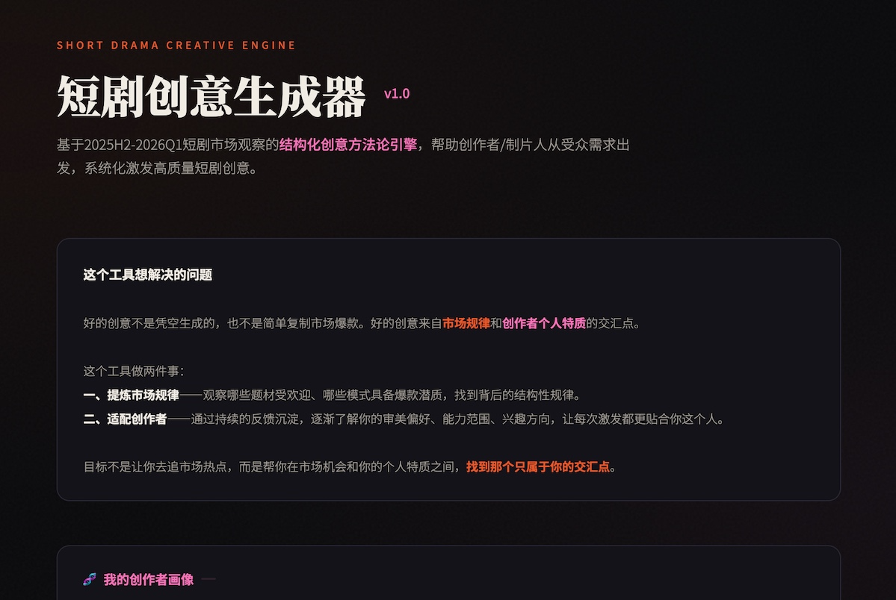
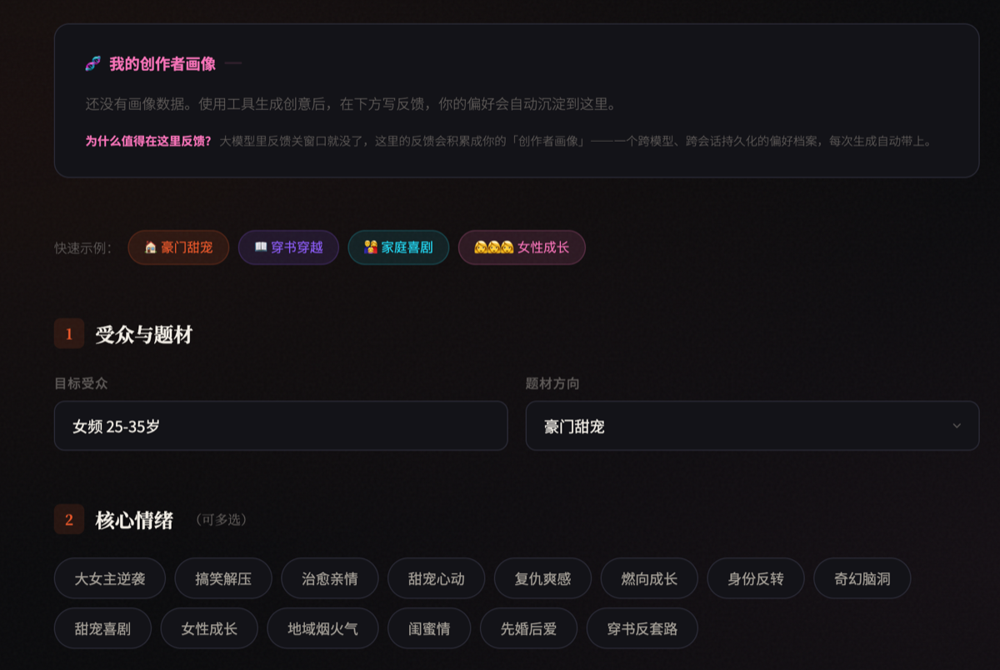
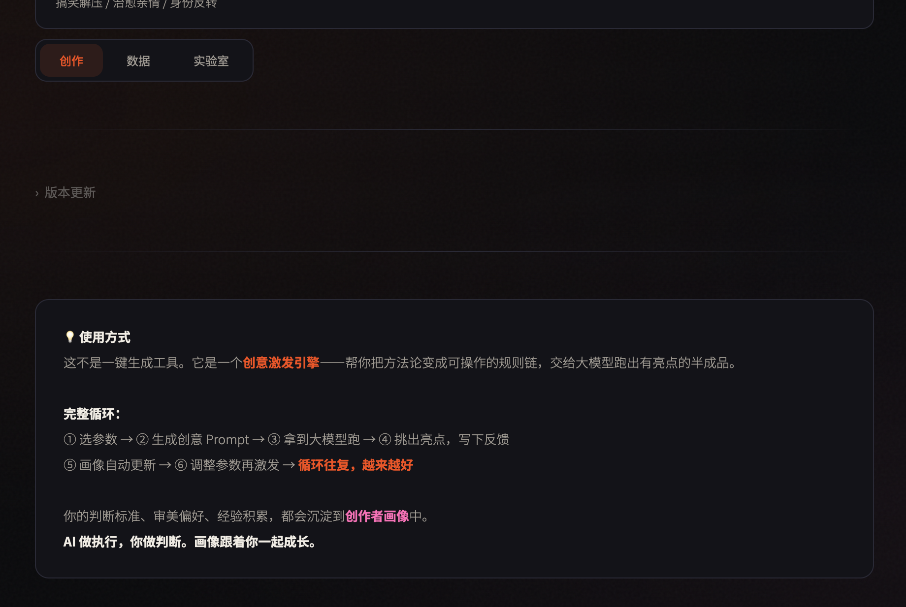

# 短剧创意生成器 — Short Drama Concept Creator

基于 2025H2-2026Q1 短剧市场爆款观察的结构化创意方法论引擎。

## 预览

<p align="center">
  
  
  
  
</p>

## 这是什么

一个 AI Skill，帮精品短剧创作者用结构化方法论激发创意。

**不是让 AI 替你写剧本，而是让 AI 成为你的创作 Soulmate。**

## 设计逻辑

创作者面对空白页时，真正卡住的不是"写不出来"，而是"不知道自己想要什么"。

AI 辅助 coding 的前提是人知道自己要什么（spec 清楚），AI 帮你实现。但创意工作里，这个前提是不成立的——创作者脑子里有的是模糊的感觉、零散的灵感、说不清的直觉，不是一个可以写成 spec 的需求。

所以这个工具做的事情不是"你告诉我要什么，我帮你生成"，而是：先用市场规律约束出一个有质量的创意空间，在这个空间里生成几个具体的、可感知的概念。你在跟这些概念碰撞的过程中，才逐渐看清自己真正想要的方向。

方法论不是模板，而是**创作者跟 AI 共享的一套判断框架**。没有这套框架，AI 给你的是"大众平均"，而大众平均的创意就是没有创意。有了这套框架，AI 的输出才站在市场规律的肩膀上。

"个人化"发生在判断的那一刻：你选了什么、放弃了什么、为什么——这些判断在帮你自己厘清"我是谁、我要什么"。工具只是把这些判断沉淀下来，让下一次碰撞更精准。

## 没有这个工具，你跟大模型直接聊会怎样？

三个问题：

1. **经验无法沉淀。** 每次对话都是从零开始。上一次你花了两小时跟 AI 碰撞出的判断、取舍、偏好——下一次对话，它全忘了。你积累的创作经验只存在于你的记忆里，AI 不知道。
2. **输出质量不可控。** 没有方法论约束，大模型的创意输出是随机的。偶尔撞上一个好概念，大部分时候是平庸模板。你没法稳定地得到 75 分以上的产出。
3. **换模型就翻车。** 你花半天调出来的提示词，换个模型效果完全不同。你的工作流被绑死在一个模型上。

这个工具解决的是：一套**稳定的、可沉淀的、跨模型的创意方法论**，不是一段提示词。

## 给谁用

- 想打造个性化精品的短剧创作者（不是日产几十部的 MCN）
- 有判断力但需要激发的策划人——你知道什么是好的，但面对空白页需要有人先扔几个 75 分的选项出来
- 有长视频经验正在迁移到短剧领域的创作者

## 为什么同时做页面和 Skill

Skill 的风险：你不知道 OpenClaw、Hermes 这些 Agent 平台到底打包了哪些系统提示词给大模型。它们的 harness 是针对 coding 设计的——工具描述、上下文注入、角色设定，都是围绕"写代码"优化的。对创作者来说，这些 coding 导向的系统提示词不是帮助，而是**污染**。你精心设计的创意方法论，被夹在一堆"你是一个编程助手"的上下文里，输出质量会打折扣。

所以这个项目有两个形态：

- **index.html（页面版）：** 直接调用 API，没有平台 harness 干扰，方法论直接跟模型对话。这是创意输出质量最可控的版本。
- **OpenClaw Skill：** 适合在 Agent 工作流中使用，方便但需要接受平台上下文可能带来的干扰。

两个版本共享同一套方法论。选择哪个取决于你更在意输出纯净度还是工作流集成。

## 怎么用

安装 Skill：

```bash
clawhub install short-drama-creator
```

或从 GitHub 直接下载到你的 skills 目录。也可以直接打开 index.html，浏览器里用。

对 AI 说：

- "帮我生成一个豪门甜宠的短剧创意"
- "我要一个穿书题材的，25-35岁女频"
- "生成一个搞笑解压的家庭喜剧创意"

AI 会自动按方法论生成 3 个差异化概念，每个包含奇幻触发器、女主身份与行动、极端身份错位、喜剧引擎、女主三关检验、CP 磕点、每集结构等要素。

## 内置方法论

7 大规则体系：

| 规则 | 核心内容 |
|------|----------|
| 规则零 | 从幻想出发，不从问题出发（能力/身份/行动） |
| 喜剧公式 | 奇幻触发器 × 极端身份错位 × 家庭关系 × 喜剧 × 治愈 |
| 大女主原则 | 观众追的是女主不是 CP |
| 标题 5 铁律 | 情绪承诺 / 反差 / 动词 / 4字或长句 / 迭代高频词 |
| 概念 3 铁律 | 一句话=情绪过山车 / 她做了什么 / 兴奋不是沉重 |
| 女主三关 | 配得感 / 快意恩仇 / 主体性 |
| 常见错误 | 避免太实的职场戏 / 文艺片感 / vlog 感 |

方法论基于 2025H2-2026Q1 短剧市场爆款观察。短剧创作意识迭代很快，更早的经验不仅不适用，反而会污染提示词。

完整方法论详见 → [methodology.md](methodology.md)

## 文件结构

```
├── index.html              # 工具主文件（零依赖，浏览器直接打开）
├── methodology.md          # 创意方法论（可独立阅读）
├── LICENSE                 # 代码许可证：MIT
├── LICENSE-METHODOLOGY     # 方法论许可证：CC BY-NC-SA 4.0
└── README.md               # 本文件
```

## 许可证

- **代码**（index.html）：MIT License — 随便用
- **方法论**（methodology.md）：CC BY-NC-SA 4.0
  - ✅ 可以学习、分享、改进
  - ❌ 不能商用（卖课、卖工具、做竞品）
  - 📝 必须署名

## 技术栈

- 前端：纯 HTML/CSS/JS，零依赖，单文件
- AI 框架：OpenClaw
- 推荐模型：MiMo v2.5 Pro / Claude / GPT — 兼容任意大模型
- 数据存储：浏览器 localStorage（数据不离开你的设备）

## 相关链接

- GitHub 仓库：https://github.com/lssuzie/Short-Drama-Concept-Creator
- 完整方法论：https://github.com/lssuzie/Short-Drama-Concept-Creator/blob/main/methodology.md
- 在线工具：下载 index.html 浏览器直接打开
